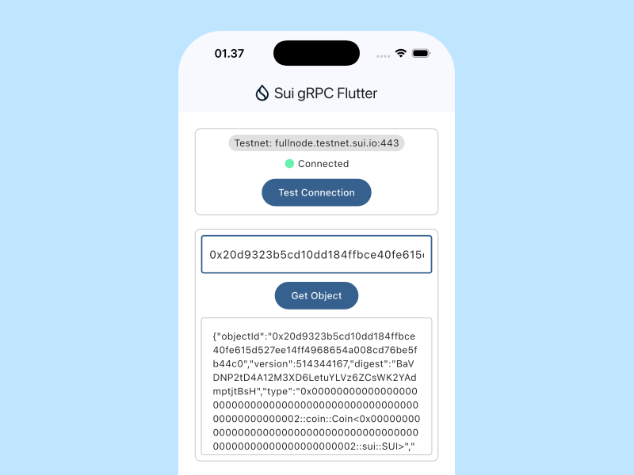

# Sui gRPC Flutter



High-performance gRPC client for Sui blockchain in Flutter applications.
https://docs.sui.io/concepts/grpc-overview

> This Flutter plugin is in active development and may introduce breaking changes. Contributions from developers who want to help shape the project at this stage are welcome. Feedback, bug reports, and pull requests are greatly appreciated as the project moves toward a stable release.

## Features
- 🚀 High-performance gRPC protocol
- 🔒 Type-safe Dart models  
- 🌐 Multi-network support (Mainnet, Testnet, Devnet)
- 🔄 Real-time subscriptions
- 📱 Cross-platform (iOS, Android, Web, Desktop)

## Usage

### 🔌 Connecting to Sui Network

This plugin simplifies integration with the Sui network by leveraging the latest gRPC protocol support.

```dart
// Connecting to devnet
final client = SuiGrpcClient.fromNetwork(SuiNetwork.devnet);

// Connecting to testnet
final client = SuiGrpcClient.fromNetwork(SuiNetwork.testnet);

// Connecting to mainnet
final client = SuiGrpcClient.fromNetwork(SuiNetwork.mainnet);
```

```dart
Future<void> _testConnection() async {
  final isHealty = await _client.isHealty();
  log(isHealty, name: '_testConnection');
}
```

### 🎣 Querying the Sui Blockchain

```dart
Future<void> _testGetObject() async {
  final objectId = _objectIdController.text;
  if (objectId.isEmpty) return;

  final object = await _ledgerService.getObject(
    ObjectId.fromHex(objectId),
    fieldMask: FieldMask.objectFull,
  );

  if (object != null) {
    log(object, name: '_testGetObject');
  }
}
```

## Quick Start

Run these commands to set up and run the application locally

### Clone the repository

```bash
git clone https://github.com/codestronaut/sui-grpc-flutter.git
```

### Get the dependencies

```bash
fvm flutter pub get
```

### Download & Generate Sui gRPC APIs

```bash
chmod +x download_protos.sh
./tools/download_protos.sh
```

```bash
chmod +x generate_grpc.sh
./tools/generate_grpc.sh 
```

### Run the example app

```bash
fvm flutter run example/lib/main.dart
```

## Roadmap

- Sui Blockchain Query 💧
- Sui Blockchain Transactions ⏳
- Wallet Integration ⏳
